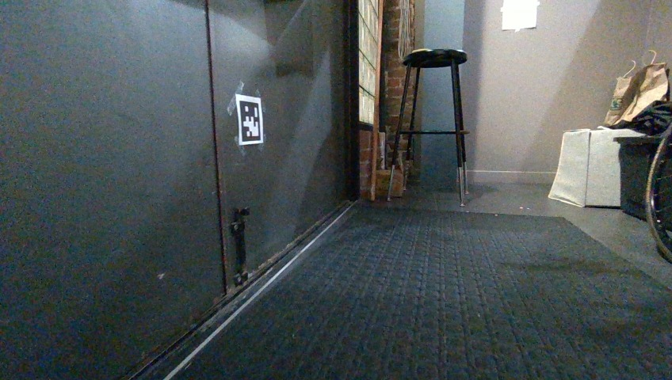
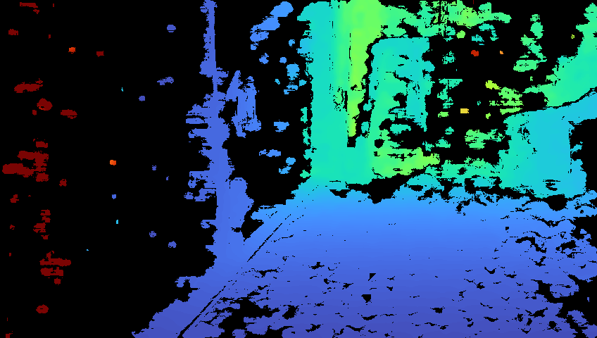
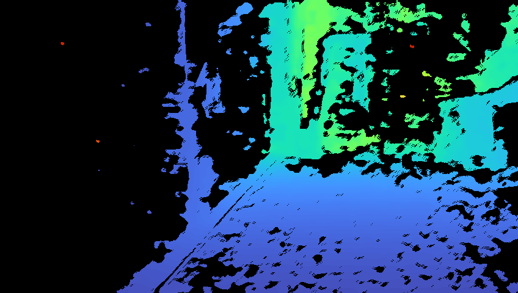
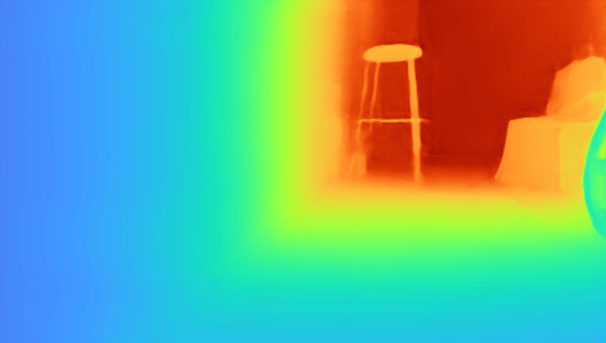
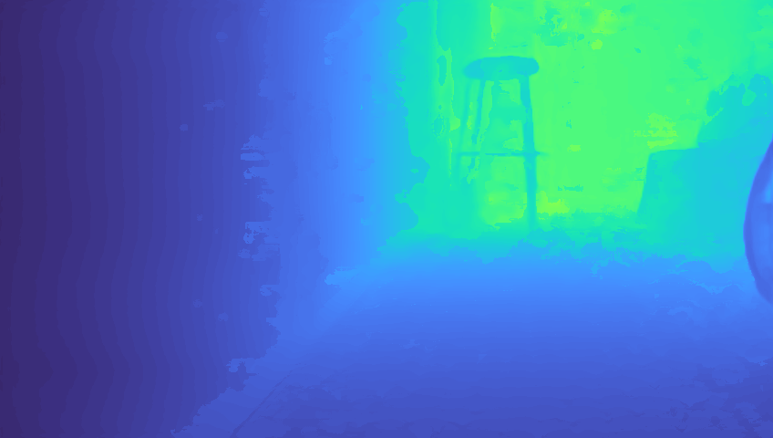
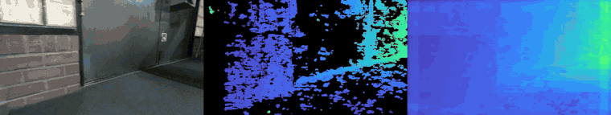
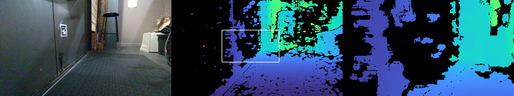
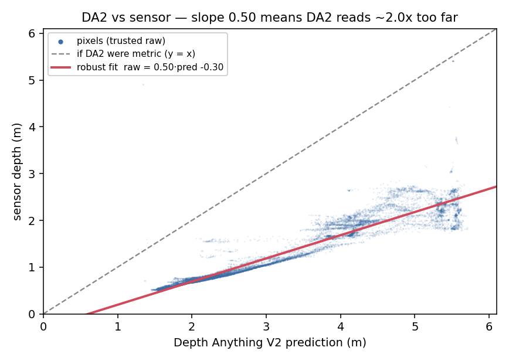
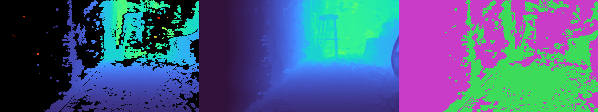

# depth2depth

Turn a noisy, hole-riddled metric depth image (RealSense-style stereo depth) into a dense one, using the matching RGB frame.

**RGB**



**Raw depth** — correct, but full of unknowns and outliers (54% of pixels unknown)



**Filtered depth** — no outliers, but too much unknown (60% of pixels unknown)



**RGB-to-depth ([DepthAnything](https://github.com/DepthAnything/Depth-Anything-V2))** — no unknowns and no outliers, but exaggerated depth (2× too far)



**Fused** — scale DepthAnything to match the raw depth, then fill in the unknowns



Over a clip — color, raw depth, fused, side by side:



## Usage

```rust
use depth2depth::{Config, Depth2Depth};
use candle_core::{Device, DType};

let mut d2d = Depth2Depth::new(
    "dinov2_vits14.safetensors",
    "da2_head_vits.safetensors",
    Device::cuda_if_available(0)?,
    DType::F16,
    Config::default(),
)?;

// rgb: HxWx3 u8, raw_depth_m: HxW f32 meters (0 / out-of-range = hole)
let fusion = d2d.fuse(&rgb, &raw_depth_m, height, width)?;
// fusion.fused: dense HxW f32 meters
// fusion.kept_raw: which pixels are untouched sensor readings
// fusion.a, fusion.b: the current affine fit
```

`Config` controls the model input resolution (default 280×504, must be multiples of 14 — smaller is faster), the raw-depth trust range (default 0.3–6 m), the agreement tolerance `max(0.3 m, 10%·z)`, and the EMA weight. `Config::default().with_quality(0.5)` scales the model resolution as a single quality/speed knob. Call `reset()` on scene cuts.

Pure Rust, no Python and no ONNX runtime at inference time. Inference runs on [candle](https://github.com/huggingface/candle), so the GPU backend is a cargo feature: `cuda` / `cudnn` (NVIDIA, incl. Jetson), `metal` (Apple), or nothing for CPU.

## The raw depth is mostly missing

Stereo depth needs texture. Blank walls, dark corners, shiny floors, thin chair legs and anything past the projector's useful range come back as nothing at all — and what does come back is speckled with single-pixel dropouts and torn object edges that flicker frame to frame.



*Left to right: color, raw depth (55% of it missing, shown black), and a 3× zoom on the boxed region — speckle and dropouts.*

On the indoor clip above, **about 60% of the pixels in an average frame have no reading at all** (53% in the easiest frames). Under 1% of that loss is "too far to measure" — the rest is the sensor simply failing on the surface in front of it. Filtering the outliers out only makes it emptier: the spatial-consistency filter in the third image above buys clean edges at the price of another 6% of the frame.

## Depth Anything V2 alone gets the shape right and the scale wrong

[Depth Anything V2](https://github.com/DepthAnything/Depth-Anything-V2) (metric, vit-small) predicts a dense depth for every pixel from RGB alone. The *structure* is excellent — walls are flat, the chair legs are there, the edges are clean. The *scale* is not usable: the wall the sensor measures at 1.69 m, DA2 calls 4.16 m. Fit a line through every trusted sensor pixel and the slope is the whole story:



The slope is **0.50**, i.e. DA2 reads about **2× too far** on this scene, and the error is not a fixed calibration you could bake in — across three frames of the same 20-second clip the slope moves between 0.49 and 0.63 as the camera turns. A pure monocular pipeline would have built a map of a building twice the size of the real one.

That is why the sensor anchor is load-bearing rather than decorative: DA2 supplies shape, the sensor supplies scale.

## Matching the two

Every frame, the prediction is affine-fitted to the pixels the sensor is trusted on:

1. **Fit** `raw ≈ a·pred + b` by least squares over the trusted pixels (`0.3 m ≤ raw ≤ 6 m`), then re-fit once more after dropping residual outliers beyond `max(0.3 m, 10%·z)`. Two rounds is enough.
2. **Smooth** `(a, b)` with an EMA across frames, so the filled regions don't flicker when the fit jumps.
3. **Keep** the raw sensor value wherever it agrees with the aligned prediction (again within `max(0.3 m, 10%·z)`), and use the aligned prediction everywhere else.



*Left to right: raw depth, fused output, and the decision mask — green is untouched sensor reading (40% of the frame), magenta is aligned prediction.*

Mean absolute error against the sensor's own trusted pixels goes from **1.79 m** for the raw prediction to **0.08 m** after the fit — the aligned prediction now agrees with the sensor where the sensor has an opinion, which is exactly what earns it the right to speak where the sensor doesn't. Roughly 40% of the output is untouched sensor reading; the rest is filled.

Nothing is smoothed or inpainted into place: real sensor geometry survives byte-for-byte, and holes get a prediction that has been forced to agree with the sensor everywhere it could be checked.

## Model weights

The crate loads two safetensors files converted from the official Depth Anything V2 metric checkpoint (Hypersim indoor, vit-small, `max_depth = 20`):

```sh
# needs: pip install torch safetensors
python tools/convert_weights.py depth_anything_v2_metric_hypersim_vits.pth weights/
```

Checkpoint download: see the [Depth-Anything-V2 metric_depth page](https://github.com/DepthAnything/Depth-Anything-V2/tree/main/metric_depth). The conversion also synthesizes the (unused) ImageNet classifier head that candle's dinov2 module insists on loading.

## Example

`examples/clip.rs` runs the pipeline over a recorded clip and writes the 3-panel video at the top of this page:

```sh
cargo run --release --features cuda --example clip -- \
    weights/dinov2_vits14.safetensors weights/da2_head_vits.safetensors \
    rgb_dir/ depth_mm.npy out.mp4 f16
```

`depth_mm.npy` is a `(frames, H, W)` uint16 array of millimeters; `rgb_dir/` holds one jpg per frame. Needs `ffmpeg` on PATH.

## Building

- NVIDIA: `cargo build --release --features cuda` (add `cudnn` if libcudnn is installed — much faster convolutions; on Jetson set `CUDA_COMPUTE_CAP` to your arch, e.g. `87` for Orin).
- Apple: `--features metal`.
- CPU: no features (slow; fine for tests).

`nix develop` gives a shell with the Rust toolchain (CUDA comes from the system, not nix).

## Notes / limitations

- vit-small only, for now. The DPT head and dinov2 modules are vendored from [candle-transformers](https://github.com/huggingface/candle) (Apache-2.0/MIT) with three changes: metric-depth output head (sigmoid × max_depth instead of relu), support for non-square inputs, and a fixed h/w ordering in the positional-embedding interpolation.
- candle's `interpolate2d`/`upsample_nearest2d` are nearest-neighbor where the PyTorch original uses bilinear/bicubic; the per-frame affine refit absorbs most of the difference.
- The affine anchor is not optional: on real indoor scenes the raw DA2 metric prediction can be off by ~2×.
- The fit is global and rigid — one `(a, b)` for the whole frame. A scene where the sensor only sees one depth band (a close-up wall, say) gives the fit nothing to lever against, and the fill degrades accordingly.
- Depth and color must be from the same moment. Pairing a depth frame with a stale color frame fills the holes with geometry from wherever the camera used to be pointing, and it looks plausible while being completely wrong.
- The figures and videos above are a 848×480 D455 clip at the default 280×504 model resolution, on an RTX 5070 laptop GPU (70.5 ms/frame end to end at f16).

## License

MIT or Apache-2.0, at your option. Vendored candle code is likewise Apache-2.0/MIT, © the candle authors.
